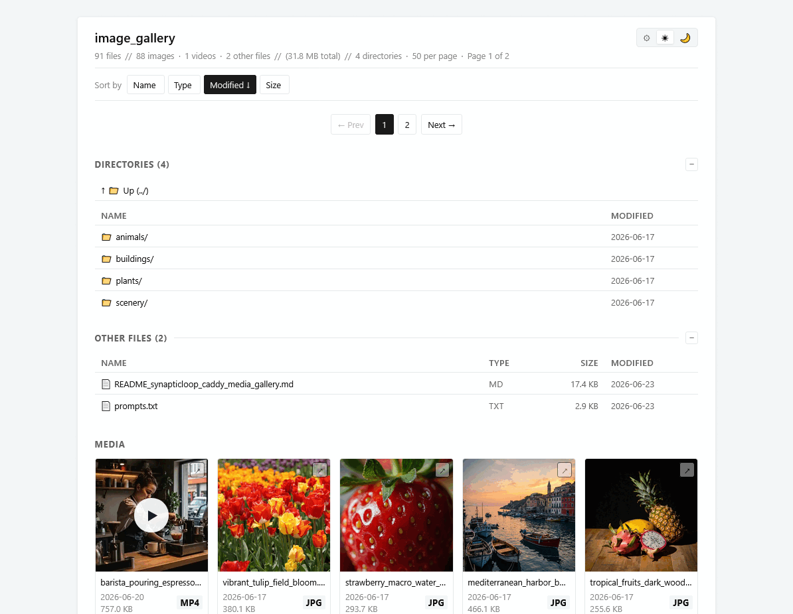
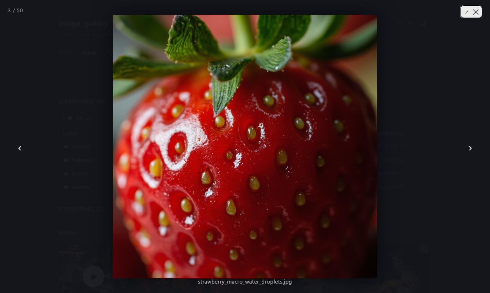

# caddy_media_gallery

*The delightful way to serve a directory.*

A Caddy v2 HTTP handler module that renders a directory as a thumbnailed
media gallery. Replaces Caddy's default `file_server browse` with a
sortable + paginated grid, click-to-expand lightbox, video support,
and a separate "Directories" and "Other files" listing for non-media content.
The visitor can switch between light and dark mode - with automatic system
defined mode pickup - with the in-page toggle (shown in the animated preview below).



## Features

- **Drop-in replacement** for `file_server browse` in a `handle_path` block.
- **Recursive** — every subdirectory under the matched route is rendered as a gallery.
- **WebP thumbnails** generated on the fly, cached on disk, invalidated by source mtime. The thumb's mtime matches the source's mtime, and an LRU eviction runs when the cache exceeds `max_cache_size_mb`.
- **Source dimensions** (W × H) shown at the bottom-left of each thumbnail as a watermark. Sourced from `image.DecodeConfig` for images (fast — reads only the header) and from `ffprobe` for videos. Both are cached in sidecar files alongside the thumbnails so the second scan is instant.
- **EXIF metadata** displayed in the lightbox for images that have it. CAMERA fields only (Make, Model, Lens, Date taken, Shutter, Aperture, ISO, Focal length) — **GPS data is never read** for privacy. An "EXIF" pill on the card lets the visitor know which images have metadata. EXIF data is read eagerly at scan time (not lazily on lightbox open) and cached in a sidecar so subsequent scans skip the parse.
- **Filename search** with two operator-configurable match modes (`search_match word|substring`, default `substring`). Live (client-side) as the visitor types, plus a "Search all" button for server-side full-directory search. Non-matching cards stay visible but are dimmed (not hidden) so the visitor keeps spatial context.
- **Hover tooltip on each thumbnail** showing the filename with the extension stripped and underscores / hyphens replaced by spaces — e.g. `misty_bamboo_forest_path.jpg` shows as `misty bamboo forest path`. Two layers: a native browser tooltip (via the HTML `title` attribute) for accessibility, plus a custom CSS tooltip (via `:before`) for instant visual feedback.
- **Type filter** — Images / Videos / Other checkboxes in the header (with a "Filter" submit button and a "Reset" pill that clears the type filter). Combined with the search filter via the URL (`?type=jpg&type=png` or `?ext=jpg&ext=png`).
- **Pagination** with a configurable per-page dropdown (operator sets the list, e.g. `page_size 30 60 120 all`; the first item is the default). Changing the page size resets to page 1 so the visitor doesn't end up on a non-existent page.
- **Click-to-sort table headers** on the Directories and Other Files tables. Sort state persists in the URL AND localStorage so the visitor's choice is remembered.
- **Vanilla JS lightbox** for click-to-expand, no external JS dependencies.

  

  Click any media tile (image or video) to open it fullscreen. The lightbox supports keyboard navigation (Esc closes, arrow keys go back/forward), a click-outside-to-close behaviour, and a play/pause control for videos. Videos show a poster (the first frame, extracted by `ffmpeg` if available) before the video plays, so the click area is always meaningful even before playback. The EXIF panel below the caption shows camera, lens, date taken, and exposure details for images that have it.

- **Light + dark mode** with a visitor-toggleable theme (auto / light / dark), persisted in localStorage. White card on grey background in light mode, dark card on near-black in dark mode. Blue accent links.
- **No-flash theme** — a tiny inline script reads the visitor's saved theme preference and applies it BEFORE the page renders, so there's no "white flash" when the visitor uses dark mode.
- **Native `loading="lazy"`** on every thumbnail, plus a subtle shimmer animation while the image loads.
- **Video support** — videos show a play-button overlay and link to the raw file. ffmpeg extracts the first frame for the poster thumbnail.
- **"Directories" section** for sub-directories with breadcrumbs (showing the path from the gallery root), counts (# items, # sub-dirs), and the directory's total size. The header shows `Directories (N)` plus `+ Parent Directory` (italicized) when there's an Up entry.
- **"Other files" section** for non-image/non-video content in a directory.

## Install

### System install (requires sudo)

Build a custom Caddy binary with this module baked in:

```bash
xcaddy build \
    --with github.com/caddyserver/caddy@v2.11.4 \
    --with github.com/synapticloop/caddy_media_gallery@latest
```

Or use the included build script (pins Caddy to v2.11.4 and the local module path):

```bash
./build.sh
```

The build script also restarts Caddy via systemd (you may need to be root or use sudo).

### Local install (no root, no sudo)

If you don't have sudo access (shared host, locked-down laptop, etc.), you can still build and run Caddy entirely from your home directory. The bundled build script has a `--user` mode that does the right thing:

```bash
# Build into ~/bin/caddy, generate Caddyfile.user, listen on port 8080.
# No sudo needed.
./build.sh --user

# Custom port (must be > 1024; the script enforces this).
./build.sh --user 9000

# Serve a different directory (default is ~/Pictures).
CADDY_USER_ROOT=~/photos ./build.sh --user 9000
```

This:
1. Builds the binary into `~/bin/caddy` (no install to `/usr/local/bin`)
2. Writes a starter `Caddyfile.user` in the project root (only on first run — your edits are preserved on subsequent builds)
3. Validates the port (must be 1025-65535) and warns if the root directory doesn't exist
4. Prints the exact commands to start Caddy in the foreground or background

Then to run Caddy:

```bash
# Foreground (Ctrl+C to stop):
~/bin/caddy run --config Caddyfile.user

# Background:
nohup ~/bin/caddy run --config Caddyfile.user > ~/caddy.log 2>&1 &
echo $! > ~/caddy.pid

# Stop the background process:
kill $(cat ~/caddy.pid)
```

Open <http://localhost:8080> in your browser to see the gallery. If 8080 is taken, choose another port — any number from 1025 to 65535 works (the script validates this for you).

## Caddyfile usage

```caddyfile
handle_path /images/* {
    root * /var/www/html/images
    media_gallery         # default: mtime desc, 320px WebP thumbs
    file_server           # serves direct file requests (e.g. /images/foo.jpg)
}

# Or with explicit sort:
handle_path /images/crosswords/* {
    root * /var/www/html/images/crosswords
    media_gallery { sort name }   # alphabetical for curated content
}
```

The `media_gallery` directive MUST come before `file_server` in the handle block — that way it gets a chance to handle the request (gallery HTML, thumbnail requests), and only falls through to `file_server` for direct file access (e.g. `/images/foo.jpg`).

### Auth

The gallery slots behind any standard Caddy auth layer (basic_auth, forward_auth, JWT, etc.) — it's just a regular HTTP handler. It does not implement its own auth.

## Caddyfile directive options

The `media_gallery` directive accepts these sub-options (full reference in [`docs/01-configuration.md`](docs/01-configuration.md)):

| Subdirective | Default | Description |
|---|---|---|
| `sort` | `mtime` | Sort field: `mtime` (newest first) or `name` (alphabetical) |
| `path_prefix` | (none) | URL mount prefix used in breadcrumbs (e.g. `images`). Defaults to the directory name. |
| `root_name` | (none) | Display name for the root breadcrumb. Defaults to "media root". |
| `image_types` | built-in list | Space-separated list of file extensions the gallery treats as images (e.g. `image_types jpg png webp`). Default: `jpg jpeg png gif webp svg avif heic`. |
| `video_types` | built-in list | Space-separated list of video extensions. Default: `mp4 webm m4v mov mkv avi ogv ogg`. |
| `page_size` | `60` | Per-page default (the first item in `page_sizes` if set). |
| `page_sizes` | `60 30 120 all` | Space-separated list of dropdown options; the first item is the default. Use `all` for "show all on one page". |
| `thumb_width` | `320` | Max width of generated thumbnails (px). |
| `thumb_height` | `320` | Max height of generated thumbnails (px). |
| `thumb_format` | `webp` | Output format: `webp`, `png`, `jpeg` (or `jpg`). |
| `thumb_ttl` | `1440` | HTTP `Cache-Control: max-age` in minutes for thumb responses. |
| `cache_scan` | `1` | In-memory scan cache TTL in minutes. |
| `no_thumbs` | `false` | Skip thumbnail generation (use original file in ``). |
| `no_video_thumbs` | `false` | Skip ffmpeg-based video poster extraction. |
| `no_exif` | `false` | Skip EXIF reading entirely (both at scan time and in the lightbox). Useful for testing or when EXIF is not desired. |
| `template` | `gallery.tmpl` | Template file name (relative to `$GALLERY_TEMPLATES_DIR`, no `..` allowed). |
| `search_match` | `substring` | Filename match rule for search: `substring` (default) or `word` (word-boundary). |
| `max_cache_size_mb` | `1024` (1 GB) | Cap on the on-disk thumb cache in MB. When the cache exceeds this, the oldest thumbs (by file mtime) are evicted until the cache is at 80% of the cap. Set to `0` to disable the cap entirely (unbounded — the pre-feature behavior). Enforced via an on-write check (cheap, runs in a goroutine after each cache write) and a background sweep every 30 min. |

Example:
```caddyfile
media_gallery {
    sort name
    page_sizes 30 60 120 all
    search_match word
    template themes/dark/gallery.tmpl
}
```

## How thumbs work

Thumb URLs look like `/_thumbs/<basename>.webp` (e.g. for source `photo.jpg`, the thumb is at `/_thumbs/photo.webp`). On first request, the module:

1. Hashes the source's absolute path (sha256, first 16 bytes).
2. Checks the cache at `/var/cache/caddy-gallery/<hash>.webp` (and the matching `.meta` and `.exif` sidecars).
3. If the cached thumb's mtime is older than the source, regenerates:
   - Decode source (jpg, png, gif, webp via stdlib + golang.org/x/image)
   - Resize to 320px wide, preserve aspect ratio
   - Encode as lossless WebP (VP8L) using github.com/HugoSmits86/nativewebp
   - Set the thumb's mtime to match the source's mtime
   - Write dimensions to `<hash>.webp.meta` sidecar and EXIF to `<hash>.webp.exif` sidecar (text format with Human-Readable keys: `Camera Make`, `Lens Model`, `Exposure Time`, etc.)
   - Return the bytes
4. Subsequent requests serve the cached file directly (with a quick `.meta` mtime touch so the LRU eviction knows the file was used).

Cache invalidation is purely mtime-based — no cron job, no inotify watcher.

**Cache directory** is `/var/cache/caddy-gallery` by default. Override with the `GALLERY_THUMB_CACHE_DIR` env var (useful for testing).

## Caching & performance

- **Scan cache** — each directory is scanned at most once per minute (mtime-keyed). For 100+ image directories like `/images/generated/`, this drops per-request work from milliseconds to microseconds.
- **Thumb cache** — WebP thumbs are written to disk and served from disk; subsequent requests are a single `os.ReadFile`. The thumb URL is content-addressed (sha256 of the source path), so the URL itself is cacheable. LRU eviction runs when the cache exceeds `max_cache_size_mb`.
- **Sidecar caches** for dimensions (`.webp.meta`) and EXIF (`.webp.exif`) are written next to the thumbnail. Both use plain-text format (key-value pairs, first line `has=true|false`) for fast parsing. The sidecar's mtime matches the source's mtime; if the source changes, the sidecar is detected stale and re-read.
- **HTTP `Cache-Control: public, max-age=86400`** on thumb responses (24h, since thumbs are immutable per source mtime).
- **HTTP `Cache-Control: no-cache`** on gallery HTML (so newly-added images show up on the next refresh).
- **Cache size cap** (`max_cache_size_mb`, default 1 GB) — when the on-disk thumb cache grows past the cap, the oldest thumbs (by file mtime) are evicted in a background goroutine until the cache is at 80% of the cap. A 30-min background sweep catches the case where the cache grows without new writes. Operators can set `max_cache_size_mb 0` for unbounded (the pre-feature behavior).
- **EXIF + dimensions reading** — both happen at scan time (not per-request) and are cached alongside the file info. EXIF costs ~1-5ms per image (header-only parse); image dimensions use `image.DecodeConfig` (header only); video dimensions call `ffprobe` (50-100ms). For a 200-image directory, the first scan after a cache miss takes ~1-2 seconds total; subsequent renders are sub-millisecond.

## Dependencies

- [caddyserver/caddy](https://github.com/caddyserver/caddy) v2.11.4 (compile-time)
- [golang.org/x/image](https://pkg.go.dev/golang.org/x/image) — for image resizing and WebP decoding (for dimension reading)
- [HugoSmits86/nativewebp](https://github.com/HugoSmits86/nativewebp) — pure-Go lossless WebP encoder (no CGO, no libwebp)
- [dsoprea/go-exif/v3](https://github.com/dsoporea/go-exif) — for EXIF metadata reading (JPEG, PNG, WebP). GPS data is intentionally never read.
- `ffmpeg` (external binary, optional) — for video thumbnail extraction. If not present, the gallery falls back to a placeholder gradient.

## Build

```bash
# Clone
git clone https://github.com/synapticloop/caddy_media_gallery
cd caddy_media_gallery

# Build (requires xcaddy and Go 1.21+)
go mod download
./build.sh
```

## Test

```bash
go test ./... -v
go test ./... -race       # race detector
```

405 tests, all standard library + stdlib-friendly patterns. No test fixtures in the repo — the test for thumbnail generation uses a programmatically-generated 640x480 JPEG. Tests cover rendering, EXIF parsing, dimension reading, search filter, sort, pagination, scan cache, and the Caddyfile parser.

## Architecture

```
caddy_media_gallery/
├── gallery.go              # Module registration, Caddyfile parser, ServeHTTP
├── scanner.go              # Directory walker + file classification (image/video/other)
├── scancache.go            # mtime-keyed in-memory cache of directory scans
├── render.go               # PageData struct, RenderPage (22 args), URL helpers, FuncMap
├── thumbnails.go           # WebP thumb generation, mtime cache, LRU eviction
├── dimensions.go           # Source dimensions reader + .meta sidecar cache
├── exif.go                 # EXIF reader + .exif sidecar cache (text format)
├── *_test.go               # Go tests (405 total)
├── build.sh                # xcaddy build + systemd restart (or --user for local install)
├── template_embedded.go     # //go:embed directive bundling the gallery template
├── templates/
│   └── gallery.tmpl        # HTML template (separate file, //go:embed'd at build time)
└── README.md               # this file
```

## Customizing the template

The HTML template lives in `templates/gallery.tmpl` and is bundled into the Go binary at build time via `//go:embed`. Two ways to customize:

1. **Edit the source template** — modify `templates/gallery.tmpl` and rebuild. The new template is bundled into the binary on the next `./build.sh`.

2. **Override at runtime** — place a modified `gallery.tmpl` at `$GALLERY_TEMPLATES_DIR/gallery.tmpl` (default `/etc/caddy/gallery-templates/gallery.tmpl`). The operator-installed template takes precedence over the bundled one. If the file is missing on startup, it's auto-extracted from the embedded copy, so you always have a starting point to edit.

## Caddyfile example (full)

```caddyfile
{
    admin off
}

your.caddy.host:443 {
    tls /etc/caddy/caddy.crt /etc/caddy/caddy.key

    route {
        basic_auth {
            youruser $2a$14$bcrypt_hash_here
        }

        handle_path /images/* {
            root * /var/www/html/images
            media_gallery
            file_server
        }
    }
}
```

## Documentation

The full documentation is also available as a single
PDF: [caddy-media-gallery-book.pdf](caddy-media-gallery-book.pdf)

A full changelog of every commit (224+ entries, grouped by date and category)
is in [CHANGELOG.md](CHANGELOG.md).

Detailed operator documentation lives in [`docs/`](docs/):

- [docs/00-readme.md](docs/00-readme.md) — documentation index + quickstart
- [docs/01-configuration.md](docs/01-configuration.md) — Caddyfile directive, JSON config, env vars
- [docs/02-configuration-reference.md](docs/02-configuration-reference.md) — one-page reference of every config knob
- [docs/03-templates.md](docs/03-templates.md) — template structure, all template variables, how to override
- [docs/04-sort-and-pagination.md](docs/04-sort-and-pagination.md) — the `?sort=&order=&page=` URL API
- [docs/05-font-credits.md](docs/05-font-credits.md) — SIL OFL 1.1 copyright notice for Libre Baskerville + JetBrains Mono (the two fonts used in the PDF)
- [docs/06-endplate.md](docs/06-endplate.md) — the back-cover ASCII art (closing plate of the PDF)

## License

MIT. See [LICENSE](LICENSE)